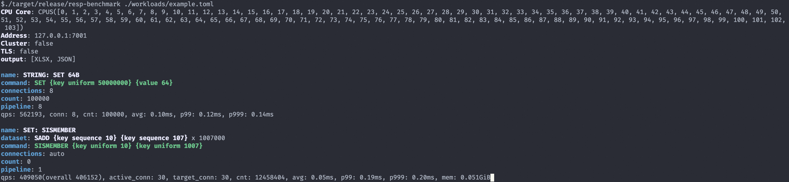

# resp-benchmark

[](https://github.com/your_username/resp-benchmark/blob/main/LICENSE)

`resp-benchmark` is a high-performance benchmarking tool designed for evaluating the performance of various databases
such as Redis, Valkey, Kvrocks, Tair, and more. It provides a robust and reproducible way to measure the throughput and
latency of database operations under different workloads.



## Features

- **🔄 Cluster and standalone modes**: Benchmark in both cluster and standalone setups.
- **⚙️ Adaptive connections**: Auto-adjust connection count based on database performance.
- **📝 Customizable workloads**: Define your workloads easily with TOML files.
- **🔧 Placeholders for custom commands**: Easily write performance tests with placeholders.
- **📊 Detailed output formats**: Export results in JSON and XLSX for analysis.
- **💡 Efficient resource use**: High performance on smaller machines.

## Getting Started

### Prerequisites

Ensure you have Rust installed. If not, you can install it from [rust-lang.org](https://www.rust-lang.org/).

### Installation

Clone the repository and build the project:

```shell
git clone https://github.com/your_username/resp-benchmark.git
cd resp-benchmark
cargo build --release
```

### Running Benchmarks

To run a benchmark, use the following command:

```shell
./target/release/resp-benchmark ./workloads/example.toml
```

## Configuration

The benchmark configuration is defined in a TOML file. Below is an example configuration:

```toml
cluster = false
address = "127.0.0.1:7001"
username = ""
password = ""
tls = false
db_type = "redis"  # redis, kvrocks, tair_mem, tair_scm, tair_ssd, garnet
output = ["xlsx", "json"]
replica_count = 0

# Leave empty to use all available CPUs. You can specify CPU cores,
# such as "0,1,6-10" to use cores 0, 1, 6, 7, 8, 9, and 10.
cpus = ""

[[cases]]
name = "STRING: SET 64B"
command = "SET {key uniform 50000000} {value 64}"
connections = 8
pipeline = 8
count = 100_000

[[cases]]
name = "SET: SISMEMBER"
dataset = { command = "SADD {key sequence 10} {key sequence 107}", count = 1007_000 }
command = "SISMEMBER {key uniform 10} {key uniform 1007}"
connections = 0
pipeline = 1
seconds = 10
```

### Field Descriptions

#### Global Configuration

- **`cluster`**: (Boolean) Specifies if the benchmark should run in cluster mode. Default is `false`.
- **`address`**: (String) The address of the database server, e.g., `"127.0.0.1:6379"`.
- **`username`**: (String) The username for database authentication. Leave empty if not required.
- **`password`**: (String) The password for database authentication. Leave empty if not required.
- **`tls`**: (Boolean) Enables TLS for secure connections. Default is `false`.
- **`db_type`**: (String) Specifies the type of database. Options include `redis`, `kvrocks`, `tair_mem`, `tair_scm`, `tair_ssd`, `garnet`.
- **`output`**: (Array of Strings) Specifies the output formats for the results. Options include `xlsx`, `json`.

#### Resource Configuration

- **`cpus`**: (String) Specifies the CPU cores to use. Leave empty to use all available CPUs. Format: `"0,1,6-10"`.

#### Test Cases

Each test case is defined in the `[[cases]]` array.

- **`name`**: (String) A descriptive name for the test case.
- **`command`**: (String) The command to be executed. Supports placeholders for dynamic data generation.
- **`connections`**: (Integer) The number of concurrent connections. Set to `0` for automatic adjustment.
- **`pipeline`**: (Integer) The number of commands sent in one batch. Must be `1` in cluster mode.
- **`count`**: (Integer) The number of operations to perform. Use either `count` or `seconds`, not both.
- **`seconds`**: (Integer) The duration to run the test case in seconds. Use either `count` or `seconds`, not both.
- **`dataset`**: (Table) Predefined dataset commands for initializing data before running the test case.

### Example Case Explanation

```toml
[[cases]]
name = "STRING: SET 64B"
command = "SET {key uniform 50000000} {value 64}"
connections = 8
pipeline = 8
count = 100_000
```

- **`name`**: "STRING: SET 64B" – This is a descriptive name for the test.
- **`command`**: "SET {key uniform 50000000} {value 64}" – Executes a SET command with placeholders for keys and values.
- **`connections`**: 8 – Uses 8 concurrent connections.
- **`pipeline`**: 8 – Sends 8 commands in one batch.
- **`count`**: 100,000 – Executes the command 100,000 times.

### Placeholder Definitions

- **`{key uniform N}`**: Generates a random key in the range `0` to `N-1`, formatted as `key_{number}`.
- **`{key sequence N}`**: Generates sequential keys, cycling through `0` to `N-1`.
- **`{value N}`**: Generates a random string of length `N` bytes.
- **`{rand N}`**: Generates a random number between `0` and `N-1`.
- **`{range N W}`**: Generates random number pairs within `0` to `N-1` with a width `W`, e.g., `0-10`.
